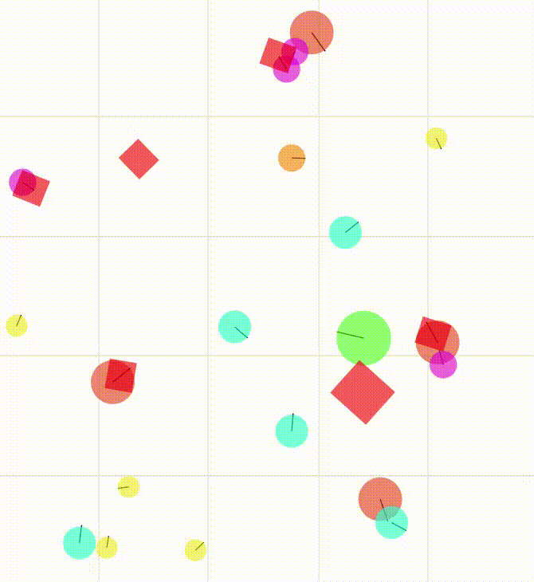

# vivarium



See the full preliminary demo [here](https://youtu.be/dnO-wo6Ns-8) !


## Installation

1- Get the repository

```bash
git clone git@github.com:clement-moulin-frier/vivarium.git
cd vivarium/
```
2- Create and activate a virtual environment (optional)

```bash
python -m venv myvenv
source myvenv/bin/activate
```

3- Install the dependencies 

```bash
pip install -r requirements.txt
pip install -e . 
```

## Usage

### Run the simulation in a server

Use the following command :

```bash
python3 scripts/run_server.py
```

### Interact with it from a web interface

And launch the web interface from another terminal :

```bash
panel serve scripts/run_interface.py --autoreload
```

Once this command will have completed, it will output a URL looking like `http://localhost:5006/panel_app`, that you can open in your browser.

### Interact with it from a jupyter notebook

You will find explanations of the web interface and how to control the simulator programmatically in the Jupyter Notebook `vivarium/notebooks/quickstart_tutorial.ipynb`

## Development

### grpc


grpc compilation command line (normally only needed if modifying the .proto file for communication between server and controllers, e.g. the web interface):

```bash
python -m grpc_tools.protoc -I./vivarium/simulator/grpc_server/protos --python_out=./vivarium/simulator/grpc_server/ --pyi_out=./vivarium/simulator/grpc_server/ --grpc_python_out=./vivarium/simulator/grpc_server/ ./vivarium/simulator/grpc_server/protos/simulator.proto
```

### Automated tests

If you want to test your changes locally, you can run the following command in the root of the directory :

```bash
pytest
```

You can add your own tests in the tests/ subdirector. Make sure that the name or your files and test functions start with "test".

## Tutorials

Several notebooks tutorials can be found in the [notebooks folder](https://github.com/clement-moulin-frier/vivarium/tree/main/notebooks), along with a tutorial for the web interface.