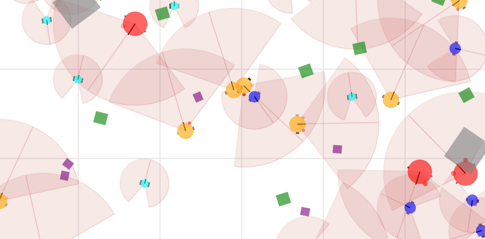

# 🌱 Vivarium

**Vivarium** is framework for for building and running multi-agents simulations using Jax. It allows you to design simple agents equipped with two motors and two sensors, inspired by [Braitenberg Vehicles ](https://en.wikipedia.org/wiki/Braitenberg_vehicle), operating in a 2D rigid-body physics environment powered by [Jax-MD](https://github.com/jax-md/jax-md).

### **Key Features**:
- **Predefined and Custom Simulations**: Quickly start with built-in scenes or create your own with customizable parameters.
- **Real-Time Interaction**: Observe and control simulations dynamically using a web interface or programmatically through Jupyter Notebooks.
- **Educational Resources**: Learn multi-agent simulation concepts with a series of interactive educational sessions.



See a preliminary demo of the project on [this video](https://youtu.be/dnO-wo6Ns-8).

## 📥 Installation

1- Clone the repository:

```bash
git clone git@github.com:flowersteam/vivarium.git
cd vivarium/
```
2- (Optional) Create and activate a virtual environment:

```bash
python -m venv env_vivarium
source env_vivarium/bin/activate
```

3- Install the dependencies:

```bash
pip install -r requirements.txt
pip install -e . 
```

## 🚀 Usage

Vivarium can be used in three main ways:  
1. **Run a simulation server.**  
2. **Interact with the simulation via a web interface.**  
3. **Control the simulation programmatically in Jupyter Notebooks.**


### 1. Run the simulation in a server 🖥️

To run the simulation in a server, use the following command:

```bash
python3 scripts/run_server.py
```

By default, the simulation will use the configuration specified in the `default.yaml` scene file, located in the `conf/scene` directory. This system enables you to create custom scene files to define the initial parameters of your simulations with [Hydra](https://hydra.cc/docs/intro/).

#### Using custom scene files 🌄

You can customize the initial simulation parameters by creating your own scene files in YAML format and placing them in this `conf/scene` directory. Scene files can specify parameters such as the number of objects, their size, or the colors, positions, and behaviors of agents for example. See Tutorial [Create a custom Scene](notebooks/tutorials/create_custom_scene_tutorial.md) for more information.

To use a custom scene file in your simulation, pass the `scene` option followed by the name of the scene file (without the `.yaml` extension) to the `run_server.py` script. For example, to run the `prey_predator_large` scene, use the following command:

```bash
python3 scripts/run_server.py scene=prey_predator_large
```

### 2. Interact via the web interface 🌐

Once the server is running, start the web interface:

```bash
panel serve scripts/run_interface.py --autoreload
```

Once this command will have completed, it will output a URL looking like `http://localhost:5006/run_interface`. Just click on it, and it will open the web interface in your browser. From here, you can observe and interact with the simulation. We recommend starting with the [Web Interface Tutorial](notebooks/tutorials/web_interface_tutorial.md) to get a better understanding of the interface and its functionalities.


### 3. Control simulations from Jupyter Notebooks 📓

You can control the simulator programmatically using Jupyter Notebooks. This allows you to manage agent behaviors, internal states, and environmental dynamics (e.g., spawning resources or interaction mechanisms). With this approach, there's no need to manually start the server or interfac. Everything can be initiated directly from the provided commands within the notebooks. 

To get started, we recommend completing the [web interface tutorial](notebooks/tutorials/web_interface_tutorial.md) first. You can then start controlling the simulation from a Jupyter Notebook by following the [quickstart tutorial](notebooks/tutorials/quickstart_tutorial.ipynb).

## 📚 Tutorials

To help you get started and explore the project, we provide a set of Jupyter notebook tutorials located in the `notebooks/tutorials` [directory](notebooks/tutorials/README.md). These tutorials cover various aspects of the project, from using the graphical interface to interacting with simulations and understanding the backend.

- **Web Interface Tutorial**: Begin with the [web interface tutorial](notebooks/tutorials/web_interface_tutorial.md) to gain a basic understanding of the project and learn how to use the graphical interface.
- **Quickstart Tutorial**: To learn how to interact with a simulation from a Jupyter notebook, follow the [quickstart tutorial](notebooks/tutorials/quickstart_tutorial.ipynb). This tutorial will guide you through creating, running, and manipulating simulations within a notebook environment.
- **Create a custom Scene**: If you want to create your own simulations with custom parameters, check out the [create a custom scene tutorial](notebooks/tutorials/create_custom_scene_tutorial.md). This tutorial will show you how to create and use custom scene files to define the initial parameters of your simulations. 
- **Simulator tutorial**: For a deeper understanding of the simulator backend and its capabilities, check out the [simulator tutorial](notebooks/tutorials/simulator_tutorial.ipynb). This tutorial provides insights into the underlying mechanics of the simulator and demonstrates how to leverage its features for advanced use cases

## 🎓 Educationnal sessions 

We offer a series of educational Jupyter Notebooks designed to teach the fundamentals of multi-agent simulation. These six sessions range from assigning basic agent behaviors to building complex eco-evolutionary environments and logging data for advanced projects.You can find these sessions in the `notebooks/sessions` [directory](notebooks/sessions/README.md). They cover topics such as:
- **Assigning reactive behaviors to agents**
- **Controlling the environmental dynamics**
- **Logging and analyzing simulation data**

## 🛠 Development

### gRPC Configuration 🔄

The projecte uses gRPC to communicate between server and clients. If you made any changes in the .proto file, you will need to recompile the gRPC files. Here is the command line instruction to do so:

```bash
python -m grpc_tools.protoc -I./vivarium/simulator/grpc_server/protos --python_out=./vivarium/simulator/grpc_server/ --pyi_out=./vivarium/simulator/grpc_server/ --grpc_python_out=./vivarium/simulator/grpc_server/ ./vivarium/simulator/grpc_server/protos/simulator.proto
```

### Running Automated Tests 🧪 

If you want to add tests for your local changes, you can write them in the `tests/` directory. Make sure that the name or your files and test functions start with "test". You can then run the following command in the root of the directory to launch them :

```bash
pytest
```

## Acknowledgments

The main contributors of this repository are Corentin Léger and Clément Moullin-Frier from the Flowers team at Inria, with participation of Martial Marzloff. CMF initiated the code base architecture in 2023 and CL was the main developper in 2024. CL was funded by the [French National Research Agency](https://anr.fr/), project ECOCURL, Grant ANR-20-CE23-0006. 
