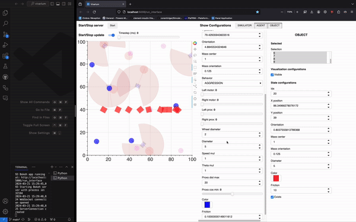

# vivarium



See a preliminary demo of the project on [this video](https://youtu.be/dnO-wo6Ns-8).

## Installation

1- Get the repository

```bash
git clone git@github.com:clement-moulin-frier/vivarium.git
cd vivarium/
```
2- Create and activate a virtual environment (optional)

```bash
python -m venv myvenv
source myvenv/bin/activate
```

3- Install the dependencies 

```bash
pip install -r requirements.txt
pip install -e . 
```

## Usage

### Run the simulation in a server

To run the simulation in a server, use the following command:

```bash
python3 scripts/run_server.py
```

By default, the simulation will use the parameters specified in the `default.yaml` scene file located in the `conf/scene` directory.

#### Using custom scene files

You can customize the initial simulation parameters by creating your own scene files in YAML format and placing them in the `conf/scene` directory. Scene files can specify parameters such as the number of objects, their size, or the colors, positions, and behaviors of agents for example.

To use a custom scene file in your simulation, pass the `scene` option followed by the name of the scene file (without the `.yaml` extension) to the `run_server.py` script. For example, to run the `session_1` scene, use the following command:

```bash
python3 scripts/run_server.py scene=session_1
```

Any parameters not specified in the custom scene file will be inherited from the `default.yaml` scene.

### Interact with it from a web interface

When the server is started, you can launch a web interface from another terminal to interact with the simulation:

```bash
panel serve scripts/run_interface.py --autoreload
```

Once this command will have completed, it will output a URL looking like `http://localhost:5006/run_interface`, that you can open in your browser.


### Interact with it from a jupyter notebook

You will find explanations of the web interface and how to control the simulator programmatically in the Jupyter Notebook `vivarium/notebooks/quickstart_tutorial.ipynb`

## Development

### Default scene generation

If you wish to make changes to the state of the simulation and change the init functions in `vivarium/simulator/states.py`, 
you can automatically generate a default yaml config file from the default parameters of the functions. 

To do so, just run : 

```bash
python3 scripts/generate_default_config.py 
```


### grpc

grpc compilation command line (normally only needed if modifying the .proto file for communication between server and controllers, e.g. the web interface):

```bash
python -m grpc_tools.protoc -I./vivarium/simulator/grpc_server/protos --python_out=./vivarium/simulator/grpc_server/ --pyi_out=./vivarium/simulator/grpc_server/ --grpc_python_out=./vivarium/simulator/grpc_server/ ./vivarium/simulator/grpc_server/protos/simulator.proto
```

### Automated tests

If you want to test your changes locally, you can run the following command in the root of the directory :

```bash
pytest
```

You can add your own tests in the tests/ subdirector. Make sure that the name or your files and test functions start with "test".

## Tutorials

To help you get started and explore the project, we provide a set of Jupyter notebook tutorials located in the [notebooks folder](https://github.com/clement-moulin-frier/vivarium/tree/main/notebooks). These tutorials cover various aspects of the project, from using the graphical interface to interacting with simulations and understanding the backend.

- **Web Interface Tutorial**: Begin with the [web interface tutorial](https://github.com/clement-moulin-frier/vivarium/tree/main/notebooks/web_interface_tutorial.md) to gain a basic understanding of the project and learn how to use the graphical interface.
- **Quickstart Tutorial**: To learn how to interact with a simulation from a Jupyter notebook, follow the [quickstart tutorial](notebooks/quickstart_tutorial.ipynb). This tutorial will guide you through creating, running, and manipulating simulations within a notebook environment.
- **Simulator Tutorial**: For a deeper understanding of the simulator backend and its capabilities, check out the [simulator tutorial](notebooks/simulator_tutorial.ipynb). This tutorial provides insights into the underlying mechanics of the simulator and demonstrates how to leverage its features for advanced use cases.