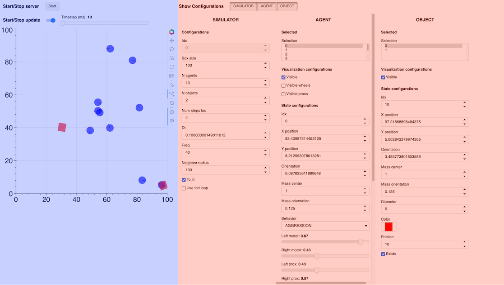

# Introduction to the web interface

The web interface has two main components:
- The simulator plot on the left (in blue)
- The configurations on the right (in red)

## Simulator plot

The plot displays the current state of the simulator, including its agents and objects.

From top to bottom can be found:

- **The start/stop button for the server**, which manages the simulation on the server side
- **The start/stop button for the plot update**, which sets if the plot should periodically refresh or not; the time step for the refresh can be set with the slider next to it
- **The simulator plot**, with the agents and objects; on the right are some tools that can be used to select these entities### Entity configurations

The configurations can be used to modify the agents, objects, or simulator attributes.
To show one configuration tab, click on the appropriate **Show Configs** toggle.

### Agents / Objects configurations
These two tabs are quite similar in structure.
From top to bottom can be found:
- **The selected list**, which indicates which entities are currently selected, either by selecting them on the plot or directly in this list.

<u>The selected entities are the ones that will be affected by the next points.</u>\
When an entity is selected, its attributes will be shown in the `configs` below. However, if multiple entities are selected at the same time (with the shift key for example), only the first selected entity will have its attributes shown below, but the modifications made on those attributes will apply for *all of the selected entities*.

- **The visualization configs**, which are used to select what is visible on the plot; checking or unchecking these boxes will make the appropriate element appear / disappear from the plot
- **The state configs**, which manages all the attributes of the agents / objects; for more details on what each configuration does, please refer to the documentation

### Simulator configurations
As there is only one simulator that is always visible, this configuration tab only shows the simulator attributes. Please refer to the documentation for further details on what each configuration does.

## Example case

Now to try and use the interface, we can start with a simple scenario with hunters and preys. We will have big hunters and small fast preys.

### Setup

You can stop the simulator so the agents are easier to select.

1. First, select a few agents either with the **Selected** list or by selecting them on the plot.
2. Now search for `Behavior` attribute in the **AgentConfig** part, click on the dropdown menu and select `FEAR`.
3. Find the `Diameter` attribute and reduce it, to 3 for example.
4. Set the `Speed mul` value to 2. 
5. Go down to find the `Color` attribute and set a color that you think fits the `FEAR` behavior, such as blue or green.
6. Repeat steps 1-5 with the other agents, give them the `AGGRESSION` behavior, increase their size, make them slower than the preys and a different color.

If you stopped the server, you can start it again, and you should see the hunter following the preys, while the preys avoid the other agents!