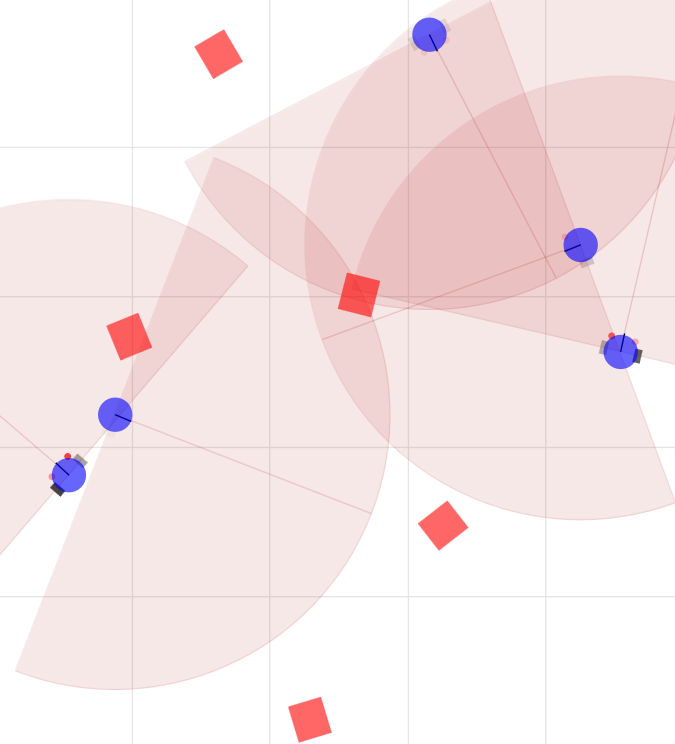
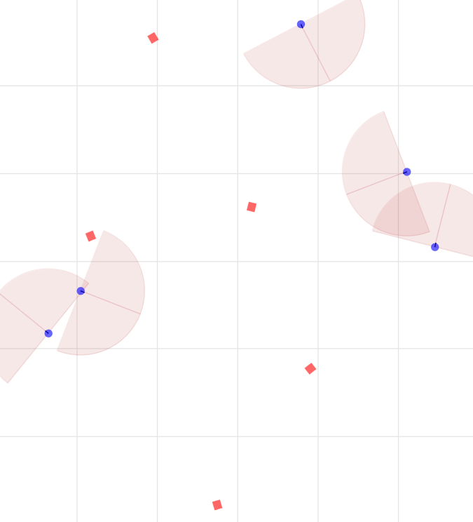
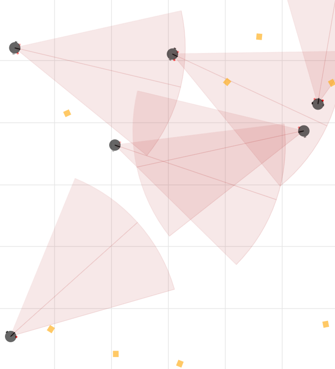
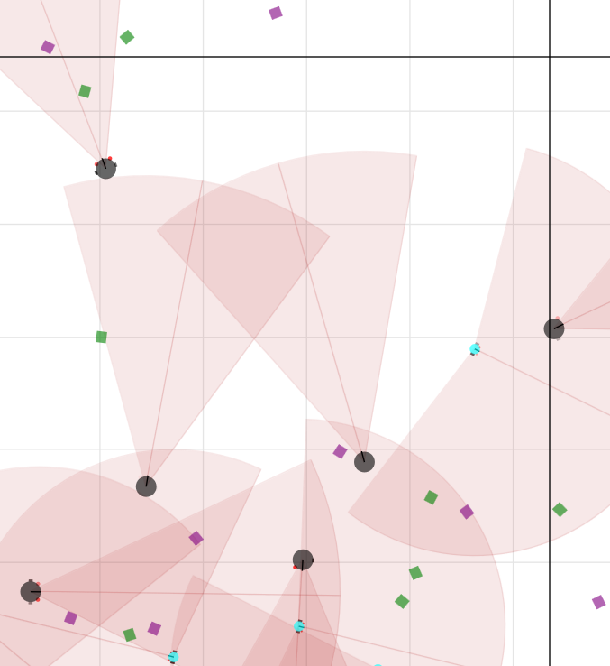
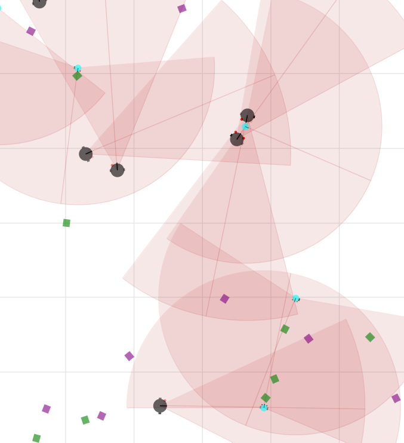

# Introduction to custom scenes creation

A scene is a YAML file that contains the initial parameters of the simulation. It can be used to customize the simulation by specifying the number of agents, their size, their colors, their positions, their behaviors, etc. The scene file is located in the `conf/scene` directory.

So if you want to create and use a custom scene, you will have to create a YAML file (e.g ```my_custom_scene.yaml```) in the `conf/scene` directory and pass its name (without the `.yaml` extension) to the `run_server.py` script : 

```bash
python3 scripts/run_server.py scene=my_custom_scene
```

## Scene file structure

To understand how these scenes work, let's start by looking at a really simple one : 

```yaml
# Entity data definitions
entities_data:
  EntitySubTypes:
    - AGENTS
    - OBJECTS

  Entities:
    AGENTS:
      type: AGENT
      num: 5
      color: blue
      selective_behaviors:
        aggr:
          beh: AGGRESSION
          sensed: 
            - AGENTS
            - OBJECTS
      
    OBJECTS:
      type: OBJECT
      num: 5
      color: red
```

This scene will produce this initial simulation :



## Scene file basic attributes

We can see it introduces the following concepts:

- `entities_data`: Contains the data of the entities in the simulation.
    - `EntitySubTypes`: Contains the different types of entities in the simulation.
    - `Entities`: Contains the data of the entities.
        - `type`: The type of the entity (AGENT or OBJECT).
        - `num`: The number of entities of this type.
        - `color`: The color of the entities.
        - `selective_behaviors`: The behaviors of the agents.
            - `beh`: The behavior of the agent.
            - `sensed`: The entities that the agent can sense.

## Scene file default attributes

The attributes defined in custom scenes are combined with the default attributes defined in the `default.yaml` scene file. The default attributes are used when the custom scene file does not specify a value for an attribute.

For example, the `default.yaml` scene file contains the following attributes:

```yaml
# Default scene is a prey predator one. This file shows how to init a simulation with multiple entities, as well as selective sensing for agents
seed: 0
n_dims: 2
box_size: 100
diameter: 5.0
friction: 0.1
mass_center: 1.0
mass_orientation: 0.125
neighbor_radius: 100  # Same as box_size
collision_alpha: 0.5
collision_eps: 0.1
dt: 0.1
wheel_diameter: 2.0
speed_mul: 1.0
max_speed: 10.0
theta_mul: 1.0
prox_dist_max: 40.0
prox_cos_min: 0.0
existing_agents: null
existing_objects: null

entities_data: None
```

If we change our simple scene file by increasing the box_size to 300, the initial simulation will look like this:



## Scene file advanced attributes for agents and objects

But this will result in a scene with inactive agents, because their proximeters are too short for these long distances. 

We can increase them and change their angle of view by adding the following attributes to the scene file. We will also by the same occasion change their color, their diameter, and will create a simulation with 10 agents but only 6 of them being initially alives. We will also do small modifications on the objects.

```yaml
box_size: 300 # Increase box size

# Entity data definitions
entities_data:
  EntitySubTypes:
    - AGENTS
    - OBJECTS

  Entities:
    AGENTS:
      type: AGENT
      num: 10 # Increase number of agents
      existing: 6 # Only 6 agents out of 10 will be alive
      color: black # Change color of agents to black
      diameter: 10.0 # Increase diameter of agents
      prox_dist_max: 150 # Increase proximeters range
      prox_cos_min: 0.90 # Decrease proximeters angle
      selective_behaviors:
        aggr:
          beh: AGGRESSION
          sensed: 
            - AGENTS
            - OBJECTS
      
    OBJECTS:
      type: OBJECT
      num: 8 # Add 8 objects
      color: orange # Change color of objects to orange

```

Here is the resulting scene:



## Adding more entities

Now that we saw how to create a simple scene, let's see how to create a more complex one. We will create a scene with 2 types of agents and 2 types of objects.

```yaml
box_size: 300

# Entity data definitions
entities_data:
  EntitySubTypes:
    - PREDATORS
    - PREYS
    - RESOURCES
    - POISON

  Entities:
    PREDATORS: # Keep the same characteristics as precedent Agents
      type: AGENT
      num: 10 # Increase number of agents
      existing: 6 # Only 6 agents out of 10 will be alive
      color: black # Change color of agents to black
      diameter: 10.0 # Increase diameter of agents
      prox_dist_max: 150 # Increase proximeters range
      prox_cos_min: 0.90 # Decrease proximeters angle
      selective_behaviors: # Keep the same behaviors at the moment
        aggr:
          beh: AGGRESSION
          sensed: # Update this to sense all entities
            - PREDATORS
            - PREYS
            - RESOURCES
            - POISON

    # Add preys entity
    PREYS:
      type: AGENT
      num: 5 # Add 5 preys agents
      color: cyan # Change color of preys agents to red
      diameter: 5.0 # Decrease diameter of preys agents
      prox_dist_max: 100 # Decrease proximeters range
      prox_cos_min: -0.20 # Increase proximeters angle
      selective_behaviors: # Keep the same behaviors at the moment
        aggr:
          beh: AGGRESSION
          sensed: 
            - PREDATORS
            - PREYS
            - RESOURCES
            - POISON
    
    # Add ressource entity
    RESOURCES:
      type: OBJECT
      num: 8
      color: green

    # Add poison entity
    POISON:
      type: OBJECT
      num: 8 
      color: purple 
``` 

We modified the entities data to have 2 types of agents and 2 types of objects. We chose a simple setting with predators and preys agents, and resources and poison objects. We give them different colors, sizes, proximeters ranges, and proximeters angles to distinguish them easiely. 

Here is the render of the scene:



## Adding custom behaviors

We already have an interesting environment to study with the last scene, but we can improve it a lot by adding custom behaviors depending on the type of the agents. For example, we can add a behavior that makes the predators chase the preys, and another one that makes the preys flee from the predators. At the same time, all agents would be repulsed by the poison objects, and the preys would be attracted to resources.

One of the constraints is that you have to give the same number of behaviors to all agents, but can have them sensing any type of entity. 

```yaml
## Modifying the agents behaviors
box_size: 300

# Entity data definitions
entities_data:
  EntitySubTypes:
    - PREDATORS
    - PREYS
    - RESOURCES
    - POISON

  Entities:
    PREDATORS: 
      type: AGENT
      num: 10 
      existing: 6 
      color: black 
      diameter: 10.0 
      prox_dist_max: 150 
      prox_cos_min: 0.90 
      selective_behaviors:
        # Add an aggression behavior towards preys
        aggr_to_prey:
          beh: AGGRESSION
          sensed: 
            - PREYS
        # Add a fear behavior towards poison
        fear_from_poison:
          beh: SHY
          sensed:
            - POISON

    PREYS:
      type: AGENT
      num: 5 
      color: cyan 
      diameter: 5.0
      prox_dist_max: 100
      prox_cos_min: -0.20 
      selective_behaviors:
        # Add an aggression behavior towards resources
        aggr_to_ressource:
          beh: AGGRESSION
          sensed: 
            - RESOURCES
        # Add a fear behavior towards predators and poison
        fear_from_preds_poison:
          beh: FEAR
          sensed:
            - PREDATORS
            - POISON
    
    RESOURCES:
      type: OBJECT
      num: 8
      color: green

    POISON:
      type: OBJECT
      num: 8 
      color: purple 
```

And we can now observe these agents behaviors if we let the simulation run for a while:



Now that you know how to create custom scenes, you can create your own and study the behaviors of the agents in the simulation. Have fun !