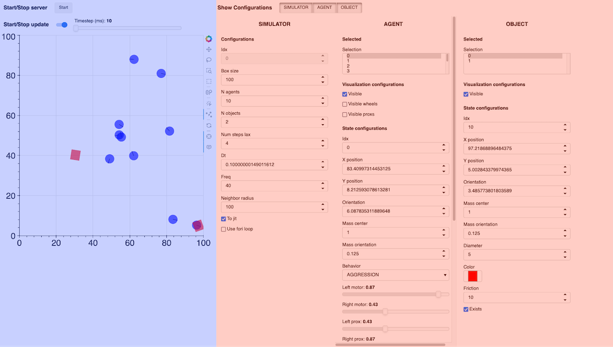

# Introduction to the web interface

The web interface has two main components:
- The simulator plot on the left (in blue)
- The configurations on the right (in red)

## Simulator plot

The plot displays a top-view of the simulated environment, consisting in a squared map. Several entities are positioned on this map. Here, entities are either agents, represented as circles, or objects, represented as squares. Agents have a front direction as indicated by the radius line on the circles. The map is a torus, meaning that an entity moving further than a map boundary will appear on the other side of the map. For instance an agent positioned at coordinate 99 on the x-axis and moving two units to the right will end up at coordinate 1 on the x-axis.

From top to bottom can be found:

- **The start/stop button for the server**, to start or stop the simulation on server side. Currently, it is recommended to stop the simulation when modifying parameters on the interface (how to modify them is explained below).
- **The start/stop button for the plot update**, which sets if the plot should periodically refresh or not; the time step for the refresh can be set with the slider next to it.
- **The simulator plot**, with the agents (circles) and objects (squares); on the right are some tools that can be used to select these entities (see the [Bokeh documentation](https://docs.bokeh.org/en/latest/docs/user_guide/interaction/tools.html#ug-interaction-tools-pandrag) for more information). The most useful tools are:
    - The `Lasso/Box select`, to easily select multiple entities at once;
    - The `Point Draw Tool`, that can be used to move the entities by dragging them around the plot (the server and plot update must be stopped beforehand);
    - The `Reset` tool sets back the plot to its original position if it has been moved around too much.

## Configurations

<!-- TODO: add a tutorial on what each attribute does -->
The configurations can be used to modify the agents, objects, or simulator attributes.
To show one configuration tab, click on the appropriate **Show Configurations** toggle.

### Simulator configurations
This configuration tab shows the simulator attributes. Please refer to the documentation for further details on what each configuration does.

### Entity configurations
An *entity* refers to a physical entity in the simulator, e.g. an agent or an object.

From top to bottom can be found:
- **The selected list**, which indicates which entities are currently selected, either by selecting them on the plot or directly in this list.

    <u>The selected entities are the ones that will be affected by the next points.</u>\
When an entity is selected, its attributes will be shown in the `configurations` below. However, if multiple entities are selected at the same time (with the shift key for example), only the first selected entity will have its attributes shown below, but the modifications made on those attributes will apply for *all of the selected entities*.

- **The visualization configurations**, which are used to select what is visible on the plot; checking or unchecking these boxes will make the appropriate element appear / disappear from the plot. Agents are simple robots with two wheels and two proximity sensors (this will be explained in more detail later), which can be visualized or not by toggling the associated checkboxes.
- **The state configurations**, which manages all the attributes of the agents / objects; for more details on what each configuration does, please refer to the documentation

## Example case

Now to try and use the interface, we can start with a simple scenario with predators and preys. We will have big predators and small fast preys.

### Setup

Before modifying the attributes, stop the server with the **Start/Stop server** button.

1. First, select a few agents either with the **Selected** list or by selecting them on the plot.
2. Now search for `Behavior` attribute in the **AgentConfig** part, click on the dropdown menu and select `FEAR`. Agents with a `FEAR` behavior will move away from others.
3. Find the `Diameter` attribute and reduce it, to 3 for example. You can directly observe the change of size on the selected agents in the simulator plot.
4. Set the `Speed mul` value to 2. This will make the selected agents move twice faster as the other (i.e. preys will move faster than predators).
5. Go down to find the `Color` attribute and set a color that you think fits the `FEAR` behavior, such as blue or green.
6. Repeat steps 1-5 with the other agents, give them the `AGGRESSION` behavior, increase their size, make them slower than the preys and a different color. `AGGRESSION` makes the agents go to the nearest entity they can see.

If you stopped the server, you can start it again, and you should see the predators following the preys, while the preys avoid the other agents!